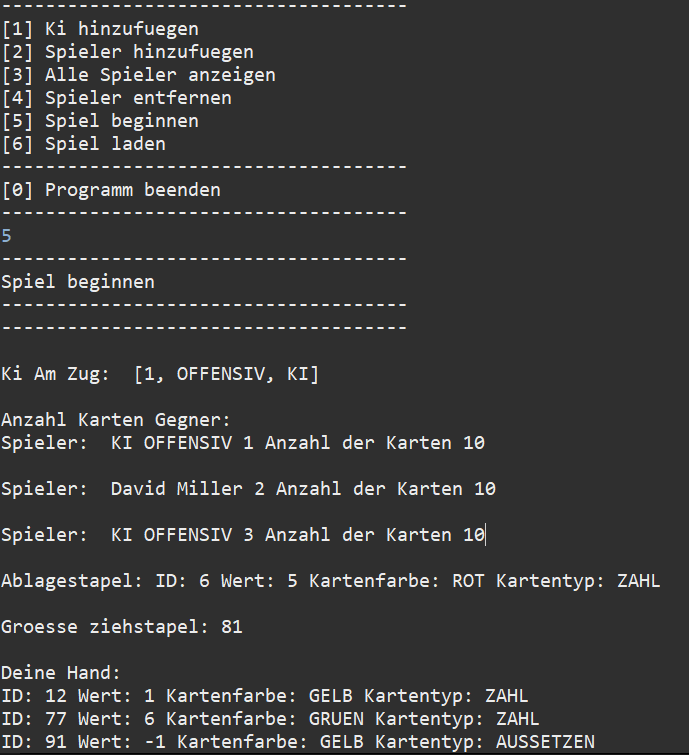
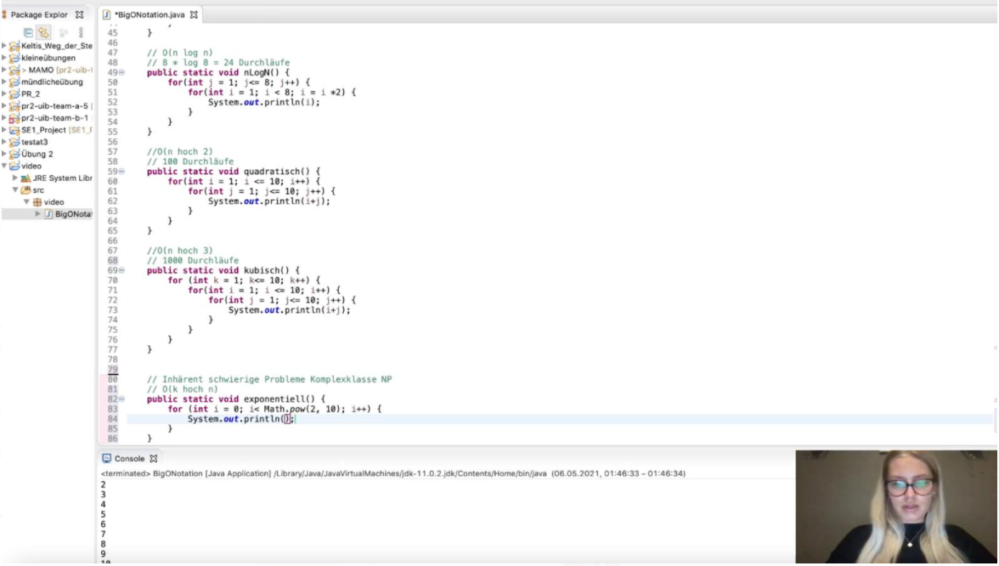

## Veranstaltung Programmierung 2, UIB
### Dozent: Prof. Dr. Frank Dopatka

[zurück zur Hauptseite...](https://informatik-mannheim.github.io/iExpo-Sommer-2021/)

## Präsentierende Team-Mitglieder
* David Miller
* Vanessa Görner

## Aufgabenstellung
### Kundenprojekt
Unsere Aufgabe lautet, das Kartenspiel „Uno“ gemäß der folgenden Regeln in Java
zu implementieren. 
[Uno Regeln](https://de.wikipedia.org/wiki/Uno_(Kartenspiel)){:target="_blank" rel="noopener"}

### Einzelarbeit
Ebenso gab es Aufgaben die in Form von Lehrvideos abzugeben waren.
### Aufteilung der Aufgaben
Es gab drei Blätter die zu bearbeiten waren.
Pro Blatt gab es in Einzelarbeit Lehrvideos zu erstellen und Aufgaben zum Kundenprojekt "Uno" .

## Klassendiagram
Ein Klassendiagram war unsere Vorlage, wie das Spiel gebaut werden soll.

## Backend

### Aufgabenblatt 1 (Kundenprojekt)
Im ersten Aufgabenblatt, war es unsere Aufgabe als Team die Logik des Spiels zu implementieren.
Das UML-Diagramm war dafür unsere Vorgabe, an welche wir uns strikt halten mussten.
#### Beispiele:
##### Kartenstock:
Um die Karten für das Spiel zu generieren mussten die Wert-,Sonder- und Farbwahlkarten generiert werden.
In diesem Beispiel werden die Normalen Wertkarten generiert:
```
for(int p = 0; p<=1; p++) {
			for (int j=0; j<Kartenfarbe.values().length-1; j++) {
				for (byte i = 0; i<=9; i++) {
					karten.push(new Karte(kartenId, i, Kartenfarbe.values()[j], Kartentyp.ZAHL));
					kartenId++;
				}
			}
		}
```

#### Spiel:
In der Spielklasse wurden die gesamten Funktionen und Logik des Spiels implementiert.
Im folgenden Code-Beispiel wird die Funktion waehleFarbe behandelt, in welcher man die Farbe nach einer schwarzen Farbwahlkarte wählen kann:
```
public void waehleFarbe(Kartenfarbe kartenfarbe) throws Exception, KarteException {
	Spiel tmpSpielStand = getInstance();
	tmpSpielStand.farbeGewaehlt = kartenfarbe;
	tmpSpielStand.logSchreiben(tmpSpielStand.spielerAmZugSpieler.toString() + " hat sich Kartenfarbe: "
			+ farbeGewaehlt.toString() + " gewuenscht. ", false);
}
```

### Aufgabenblatt 2 (Kundenprojekt)
Im zweiten Aufgabenblatt wurde der Schwerpunkt des Projektes auf das Laden und Speichern sowie der KI des Spiels gesetzt.
Die KI sollte laut Aufgabenstellung Offensiv oder Defensiv einstellbar sein. 
Das Laden und Speichern folgt über das Persistenzinterface, mit welchem man in eine CSV oder SER Datei das Spiel speichern kann.
#### Beispiele:
##### Laden und Speichern:
Mit der Implementierung dieses Interfaces kann der aktuelle Spielstand gespeichert oder ein alter Spielstand geladen werden:
```
interface PersistenzInterface {
/**
 * Methoden, welche ueber das PersistenzInterface aufgerufen werden, um die Spielstaende zu verwalten.
 */
    final String CONST_DIR_FILE_SAFE = "Spielstaende/";

    // rueckgabewerte auschlieslich pro. werte
    public void oeffnen(Properties p) throws IOException, CSVException;
    public void schliessen(Properties p) throws IOException;
    public Properties lesen(Properties p) throws Exception;
    public void schreiben(Properties p) throws Exception;
    public String[] listDirectory() throws Exception;

}
```
##### KI:
Das ist der Konstruktor um die KI zu erstellen:
```
public KI(Spiel spiel, int id, String vorname, String nachname, Strategie strategie) throws UnoException {
		super(spiel, id, vorname, nachname);
		this.setStategie(strategie);
	}
```
Die Logik und Funktionen der KI wurden in der Spiel-Klasse festgelegt, in diesem Beispiel wird die Entscheidungslogik der defensiven KI gezeigt:
```
if (tmpSpielStand.strategie.equals(Strategie.DEFENSIV)) {
			if (!tmpSpielStand.getNormaleKarten().isEmpty()) {
				for (Karte k : tmpSpielStand.getNormaleKarten()) {
					if (tmpSpielStand.getRundenZaehler() == 0 && tmpSpielStand.ablagestapel.schauAufOberste()
							.getKartenfarbe().equals(Kartenfarbe.SCHWARZ))
						return k;
					if (k.getWert() == tmpSpielStand.ablagestapel.schauAufOberste().getWert()
							|| k.getKartenfarbe() == tmpSpielStand.ablagestapel.schauAufOberste().getKartenfarbe()
							|| (tmpSpielStand.getFarbeGewaehltObjekt() != null
									&& tmpSpielStand.getFarbeGewaehltObjekt().equals(k.getKartenfarbe())))
						return k;
				}
				if (!tmpSpielStand.getSonderKarten().isEmpty()) {
					for (Karte k2 : tmpSpielStand.getSonderKarten()) {
						if (k2.getKartenfarbe().equals(tmpSpielStand.ablagestapel.schauAufOberste().getKartenfarbe())
								|| k2.getKartentyp().equals(tmpSpielStand.ablagestapel.schauAufOberste().getKartentyp())
								|| (tmpSpielStand.getFarbeGewaehltObjekt() != null
										&& tmpSpielStand.getFarbeGewaehltObjekt().equals(k2.getKartenfarbe())))
							return k2;
					}
					return null;
				} else {
					return null;
				}
```

### Aufgabenblatt 3 (Kundenprojekt)
Im dritten und letzten Aufgabenblatt kamen noch das Logging und Threads für das Backend des Spiels dazu.
Unsere Gruppe hatte mit den Threads einige Probleme und konzentrierte sich mehr auf die Logs.
#### Beispiele:
##### Logging:
Um eine Log schreiben zu können, wurde die Methode logSchreiben in die Klasse Spiel implementiert.
Diese greift auf das Persistenz-Interface des Spiels zu um die Logs in eine Log Datei zu schreiben und zu speichern.
In diesem Code-Beispiel wird die Methode um den Log zu schreiben gezeigt:
```
public void logSchreiben(String logInfo, boolean isErr) {
		Properties p = new Properties();
		persistenzInterface = new PersistenzImplCSV();
		p.setProperty("dateiName", "Spiel.log");

		String log = "";
		SimpleDateFormat df = new SimpleDateFormat("dd MM yyyy HH:mm:ss");
		Date datum = new Date();
		if(isErr) log += "Error: ";
		else log += "Info: ";

		log += "[" + df.format(datum) + "] ";
		log += logInfo;
		log += "\r\n";

		p.setProperty("daten", log);
		try {
			persistenzInterface.oeffnen(p);
			persistenzInterface.schreiben(p);
			persistenzInterface.schliessen(p);
		} catch (Exception e) {
			e.printStackTrace();
		}
	}
```
Die Log-Datei hat dann Info und Error Einträge, welche per methode bestimmt werden können (Boolean).
Eine Ausgabe könnte wie folgt aussehen :
* Info: [17 06 2021 00:51:53]  KI OFFENSIV 1 hat eine Karte ID: 92 Wert: -1 Kartenfarbe: GELB Kartentyp: UMDREHEN gezogen.

## Frontend
Das Frontend des Spiels kam erst mit Aufgabenblatt 3.
Davor wurde das Spiel per Command Line In gesteuert.
Dies sah wie folgt aus:



### Aufgabenblatt 3:
Mit dem dritten Aufgabenblatt kam die Aufgabe dem Spiel ein Frontend Design zu verpassen.
Dies kann man in Java mittels Swing GUI realisieren.
Das Frontend wurde nicht fertig, jedoch wurden ein paar Funktionen wie zum Beispiel das Legen/Ziehen der Karten implementiert.
Das sieht wie folgt aus:


## Lehrvideos
Die Aufgaben zu Lehrvideos wurden in jedem Blatt gestellt.
Im Folgenden werden die erbrachten Lehrvideos beschrieben.
### David Miller
#### Thema: 
Anweisungen-Datentypen-Operatoren-Konstanten sowie
UML-Aktivitätsdiagramm-Verzweigungen-if-else-switch

#### Beschreibung:
In diesem Video wurde erläutert, welche Elemente das UML-Aktivitätsdiagramm hat. Zusätzlich wurden Verzweigungen wie If-Else und Switch erklärt.
Das komplette Video ist in Youtube durch einen Klick auf das Bild verfügbar:

[](https://www.youtube.com/watch?v=Cem_CkfDM5A&t=2721s/){:target="_blank" rel="noopener"}


#### Thema:
Exception-Handling-Strukturierung

#### Beschreibung:
In diesem Video wurden Exceptions vorgestellt und wie man mit diesen in Java umgeht.


#### Thema:
Aggregation, Komposition, Enum, Annotation

#### Beschreibung:
In diesem Video wurden die Aggregation und Komposition vorgestellt und verglichen. Zusätzlich wurden Enumerations und Annotationen erklärt


#### Thema:
Nebenläufigkeit: Threads, Races, Deadlocks

#### Beschreibung:
In diesem Video wurde erklärt wie man in Java Threads erstellt. Races und Deadlocks wurden in Verbindung mit den Threads gebracht.


### Vanessa Görner
#### Thema: 
Objekt, Eigenschaften, Getter, Setter, Konstruktoren

#### Beschreibung:
In diesem Video wurden die Basics zur Objektorientierung erlaeutert und anhand eines Beispiels aufgefuehrt.


#### Thema:
Komplexitaet-O-Notation-P-NP

#### Beschreibung:
in diesem Video werden Laufzeitkomplexitaeten anhand von einfachen Beispielen erklaert.
Das komplette Video ist in Youtube durch einen Klick auf das Bild verfügbar:

[](https://www.youtube.com/watch?v=1sp5iy-qPyc&t=925s/){:target="_blank" rel="noopener"}


#### Thema:
Assoziation, Vererbung, Abstract, Polymorphie 

#### Beschreibung:
In diesem Video wurden die Begriffe Assoziation, Vererbung, Abstract, Polymorphie anhand von einem Anwendungsfall dargestellt.


#### Thema:
Datenstrukturen: Graphen, Dijkstra, Faerbung

#### Beschreibung:
in diesem Video wurden Graphen erklaert und ein eigenes Faerbungsproblem geloest.


