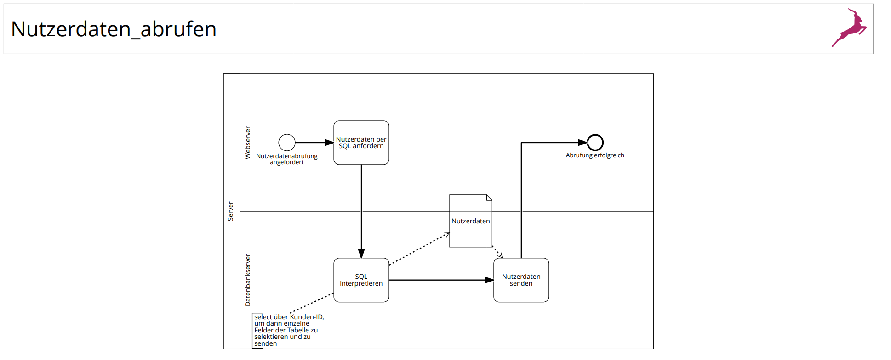
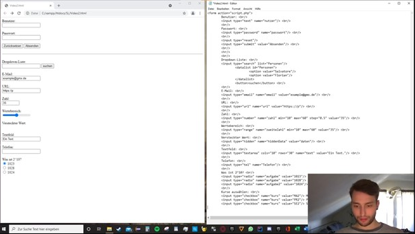

## Veranstaltung Programmierung 2, UIB
### Dozent: Prof. Dr. Frank Dopatka

[zurück zur Hauptseite...](https://informatik-mannheim.github.io/iExpo-Sommer-2021/)

Wir, das Team B1, bestehend aus:
* Daniel Kalotai
* David Miller
* Florian Krembel
* Vitali Lenhardt
* Salvatore Scionti

aus der Vorlesung Webbasierte Systeme stellen unser Projekt vor.


## Aufgabenstellung
### Ausgangssituation:
```
Eine vierköpfige Familie kommt aus Bulgarien nach Mannheim. Die Mutter A. (34) und Vater P.
(35), die Kinder S. (8) und T. (5). Die Eltern haben jeweils ein Smartphone.
Die Eltern möchten in Deutschland arbeiten. Um eine Arbeit aufnehmen zu können, brauchen sie
eine Krankenversicherung und ein Bankkonto. Das haben sie von Freunden erfahren, die schon
länger in Deutschland sind.
Um eine Krankenversicherung und ein Bankkonto zu bekommen, benötigt man eine Adresse. Also
eine Wohnung und ein Dokument, welches die Meldeadresse bestätigt. Dies geschieht über einen
Ausweis und einer amtlichen Meldebescheinigung. Alle Briefe und Bescheinigungen erhält die
Familie natürlich auf Deutsch, aber niemand liest oder spricht Deutsch.

```
Unsere Aufgabenstellung war es als IT-Unternehmen eine HTML5-basierte App zu dem zugewiesenen Thema zu entwickeln, die für Smartphones
optimiert ist.
Unser zugewiesenes Thema war ein Formular zur Wohnungsanmeldung der Statd Mannheim. 


### Skizzierte Abläufe:
```
Beim Starten der App wird man im allerersten Schritt nach der Sprache gefragt. Die App soll die
Familie über den Inhalt und Kontext von solchen Briefen und Formularen sowohl in einfachem
Deutsch, als auch in einfachem Englisch aufklären. Weitere Sprachen sind gewünscht, wenn Ihre
Teambesetzung dies hergibt.
Man soll sich an der App registrieren können mit einer Mailadresse und einem Kennwort.
Zusätzlich soll bei der Registrierung optional der Vorname, Nachname, die Anschrift und das
Geburtsdatum eingegeben werden können. Meldet man sich nach der Registrierung über einen
Login an, so stehen alle zuvor eingegebenen Daten aus einer Datenbank zur Verfügung.
Die App soll aber auch ohne eine Registrierung bedienbar sein, in dem sie nur bei einem einzigen
konkreten Dokument unterstützt.
Nach dem Login oder auch direkt soll die App nachfragen, bei welchem Dokument sie unterstützen
soll? Dies soll ein Brief, ein Formular oder ein Vertrag sein. In diesem Semester werden das nur
Formulare sein. Danach soll man das konkrete Formular auswählen können, um das es geht.
Optional soll es möglich sein, nach der Dokumentauswahl „Brief“ ein Foto der ersten Seite eines
Briefs auf Ihren Server hochzuladen. Dieser führt dann z.B. eine OCR-Texterkennung durch und
ist in der Lage, den Brief selbst zu identifizieren. Für eine solche Lösung werden Sie im späteren
Verlauf Zusatzpunkte erhalten.
In allen Fällen weiß die App nun, welches konkrete Dokument zu bearbeiten ist. Sie bietet nun
dreierlei Dienstleistungen an.
Einerseits wird die Bedeutung des Dokuments in der ausgewählten Sprache sehr leicht
verständlich erklärt.
Andererseits soll man alle Daten in sehr einfachen HTML-Formularfeldern eingeben können, so
dass das Formular ausgefüllt wird. Dazu bietet die App abschließend den Download des
ausgefüllten Formulars als PDF-Datei an.
Drittens verweist die App mit dem folgenden Text und Link an einen Kontakt, wenn man noch
weitere Hilfe braucht: „Wenn Ihnen irgendwas unklar geblieben ist, oder Sie weitere Fragen haben, 
kontaktieren Sie bitte eine Beratungsstelle wie die ANIMA unter
https://www.mannheim.de/de/service-bieten/integration-migration/anima-ankommen-in-mannheim“
```

### Aufgabenblätter
Die Aufgaben wurden in drei Blätter aufgeteilt. Jede Aufgabe wird mit der Lösung in der folgenden Präsentation gezeigt.
Neben des Projektes gab es noch Einzelleistungen zu bearbeiten. Diese war die Erstellung von Lehrvideos. Jedes Teammitglied hatte ein individuelles Thema zugewiesen bekommen.
Die erstellten Lehrvideos werden auch in der folgenden Präsentation vorgestellt.


## Aufgabenblatt 1
Im ersten Aufgabenblatt bestand unsere Aufgabe darin, die oben skizzierten Abläufe der App detailliert
anhand von Diagrammen zu beschreiben: 
* Was kann der Benutzer genau tun?
* Was tut daraufhin die App auf dem Client und was passiert dann auf dem Server?

Die Fachlogik war komplett serverseitig zu implementieren.
Die Diagramme wurden jeweils als BPMN Modelle bearbeitet.

### Diagramme





### Lehrvideos aus Blatt 1
#### Daniel Kalotai
##### Thema: 
HTTP-Server-CGI-Module

##### Beschreibunbg:  
In diesem Video wurde erläutert, wie die HTTP-Server-CGI-Module funktionieren mit einem Apache2 Webserver (Anhand einer lokalen Installation).


##### Thema: 
Tools der Übung

##### Beschreibung: 
In diesem Video wurden die Tools WireShark und Postman vorgestellt. WireShark mit einem PXE Boot Beispiel, in dem gezeigt wurde, dass der DHCP keine IP Addresse
vergibt, aufgrund von fehlenden PXE Parametern. Postman wurde vorgestellt mit einer REST-Api und mit verschiedenen GET/POST/PUT Routen.


#### David Miller
##### Thema: 
Tools der Übung

##### Beschreibung: 
In diesem Video wurden die Installation und die Verwendung der Tools Wireshark, Postman und XAMPP mit ihren wichtigsten Funktionen vorgestellt. 
Bei XAMPP liegt die Verwendung von PHP und der Datenbank MySQL/MariaDB über phpMyAdmin im Fokus.


#### Florian Krembel
##### Thema: 
Schichtenmodell-HTTP-HTTPS sowie URI-URL-URN

##### Beschreibunbg: 
Einige technische Grundlagen zur Webkommunikation werden anhand von Definitionen und Beispielen erklärt. Darüber hinaus wird der Aufbau und Unterschied von URI,
URL und URN erläutert.


##### Thema:
HTML – Formulare

##### Beschreibung: 
Es werden diverse HTML5-Formulare beispielhaft gezeigt und erklärt.


#### Vitali Lenhardt
##### Thema: 
HTTP-Kommunikation zwischen Client und Server

##### Beschreibung: 
Erstellung von Requests und Erklärung der dazugehörenden Responeses anhand von Postman.
Außerdem das Erklären der aufgezeichneten Pakete der HTTP-Kommunikation mit Wireshark


##### Thema: 
Grundlagen und Neuerungen von HTML

##### Beschreibung: 
Erstellung einer einfachen HTML5-Seite.
Erklären der Grundlagen wie zum Beispiel Listen, Verankerungen und Medieneinbindungen (Bild, Audio, Video).


#### Salvatore Scionti
##### Thema: 
Schichtenmodell-HTTP-HTTPS sowie URI-URL-URN

##### Beschreibung: 
In diesem Video wird einerseits sehr theoretisch das Schichtenmodell (OSI/TCP-IP) sowie der Unterschied zwischen URI, URL und URN vorgetragen, andererseits etwas praktischer
HTTP und HTTPS anhand von Wireshark durchleuchtet. Hierzu wird auf die Seite der Hochschule zugegriffen.


##### Thema: 
HTML – Formulare

##### Beschreibung: 
Anhand eines frisch erstellten HTML-Dokumentes werden die Formularelemente von HTML5 vorgestellt. Dafür wird Schritt für Schritt auf ein jedes Feld sehr ausführlich eingegangen.




## Aufgabenblatt 2
Aufgabenblatt 2 beschäftigte sich mit dem Frontend des Clients, welches für mobile Endgeräte optimiert werden soll.
Es soll eine Homepage im HTML-5 Format erstellt werden, diese soll folgende Hauptseiten beinhalten:
* Über uns
* Login-Formular mit Benutzernamen und Kennwort
* Menüseite
* Datenschutz
* Impressum

Zusätzlich soll die Antragsstellung vollständig assistenten-basiert in Form von HTML5-
Formularen implementiert werden. 

### Frontend Beispiele:
#### Anmeldung:


#### Menue Auswahl:


#### Daten zur neuen Wohnung:


### Vorstellung der HTML-5 Seiten (Video)
In diesem Video wird die komplette Webseite präsentiert. Sie können gerne auf das Bild klicken (Link zum Video).

[](https://www.dropbox.com/s/rpaw4yw7s2vdzqe/Web%20Video.mp4?dl=0/)

### Lehrvideos aus Blatt 2
#### Daniel Kalotai
##### Thema: 
JavaScript: Objekte

##### Beschreibung:
In diesem Video werden die JavaScript Objekte vorgestellt, wie man auf diese zugreifen/erstellen kann und wie man anhand eines Prototypes Funktionen vererben kann.
Ebenso werden auch die verschiedenen Funktionen gezeigt, wie ein Objekt anhand einer Factory Funktion, Konstruktor oder auch die Klassen in Javascript aussehen. Datahiding wird
ebenfalls angesprochen, sowie die Vererbung von Objekten.

[](https://www.youtube.com/watch?v=Y8LBUTZn9xQ/)

#### David Miller
##### Thema: 
CSS: Einleitung, Farben, Maßangaben, Einbinden in HTML-Dateien

##### Beschreibung:
In diesem Video wurde erläutert, wie man eine HTML Datei mittels CSS visuell verändern kann. 


#### Florian Krembel
##### Thema: 
Javascript DOM

##### Beschreibung:
Das Document-Object-Model wird erklärt, außerdem werden einige Javascript-Funktionen zur Manipulation des DOM-Baums anhand diverser Beispiele gezeigt und
erläutert.


#### Vitali Lenhardt
##### Thema: 
JavaScript: Eventhandler

##### Beschreibung: 
Erstellung einer HTML5-Seite mit der Einbindung von JavaScript beziehungsweise dessen Eventhandler.
Darstellen einfacher Beispiele um die ereignisbasierte Programmierung zu veranschaulichen.


#### Salvatore Scionti
##### Thema: 
CSS: Box-Modell

##### Beschreibung: 
Auch hier wird eine HTML-Datei erstellt, dieses Mal jedoch begleitet von einer CSS-Datei, welche die HTML im Rahmen des sogenannten Box-Modells ausschmückt. Um das zu tun,
schauen wir uns im Video etliche Möglichkeiten an, das zu tun.


## Aufgabenblatt 3
Im dritten und letzten Aufgabenblatt, wurde gefordert, das Backend hinter der Webseite zu erstellen.
Im Backend sollen alle Prüfungen der Registrierung/Anmeldung stattfinden und die Benutzer sollen in eine
Datenbanktabelle eingetragen werden. Zusätzlich sollen alle Einträge/Formulare des Benutzers in der Datenbank gespeichert werden
damit dieser nach erneutem Anmelden wieder darauf zugreifen kann.
Zuletzt soll eine Dokumentation erstellt werden, welche dem Kunden das komplett erstellte Projekt mithilfe einer
verständlichen Installationsanleitung erklärt.

### Beispiele der Datenbank
Hier sehen Sie die Tabelle benutzer in unserer Datenbank. Hier werden alle Daten bezüglich der Registrierung gespeichert.


### Server Skripts
Anbei sehen Sie unser Update-Skript, um den aktuellen Stand auf den Server zu pullen.


Ebenso hier ein Einblick in die Cronjobs, welche dazu dienen Skripts zum Startup des Servers auszuführen


### Dokumentation
Dies ist die vollständige Dokumentation unseres Projektes.
Das Bild verweist mit einem Klick auf die PDF Datei.
Viel Spaß!

[](https://www.dropbox.com/s/wa6czkhjhyxx6fq/Dokumentation_WEB_B1%20%281%29.pdf?dl=0/)


### Lehrvideos aus Blatt 3
#### Daniel Kalotai
##### Thema: 
Node.js: WebSockets, socket.io, Ajax

##### Beschreibung:
Beschreibung


#### David Miller
##### Thema: 
Web-Architekturen: Architekturprinzipien, Frameworks, Selenium

##### Beschreibung:
In diesem Video wurden Architekturprinzipien mit Beispielen erklärt. Frameworks kurz behandelt und das Selenium Framework benutzt.


#### Florian Krembel
##### Thema: 
Node.js: Express.js, Grundlagen, Anwendungen, Formulardaten, Session

##### Beschreibung:
Es wird gezeigt wie man mithilfe von Express.js das Grundgerüst für einen Webserver erstellt und diesen zum Laufen bringt. Außerdem wird erklärt wie man für diesen HTTPS und
Sessions einrichtet sowie das Auswerten von Formulardaten und das Erstellen eines Server-Gerüsts mit Hilfe von express-generator.


#### Vitali Lenhardt
##### Thema: 
Node.js: Grundlagen, Webserver, HTTP, HTTPS

##### Beschreibung: 
Einführen in die Laufzeitumgebung Node.js sowie die Erstellung eines simplen Webservers unter Verwundung von HTTP/HTTPS.


#### Salvatore Scionti
##### Thema: 
Web-Architekturen: REST, publish-subscribe

##### Beschreibung: 
In diesem Video zeige ich ein kleines Beispiel zur REST-Architektur, welches leider aufgrund von Genehmigungsproblemen seitens des Hosts, den ich versuche anzuknüpfen, nicht
komplett gezeigt werden kann. Beim Thema publish-subscribe handelt es sich um typische „Abos“. Ein Benutzer registriert sich und erhält eine Meldung im Rahmen des Dienstes,
sobald es eine hierfür angemessene Aktualisierung gibt (wie ein Newsletter). Leider jedoch zeige ich kein eigenes Beispiel dazu, da ich es aus verschiedenen Gründen nicht
hinbekommen habe. Dieses Video ist also etwas mager.


---

[zurück zur Hauptseite...](https://informatik-mannheim.github.io/iExpo-Sommer-2021/)


